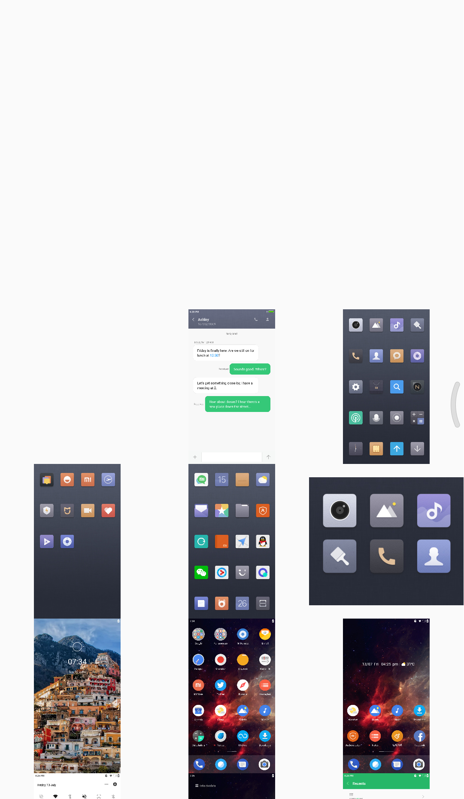
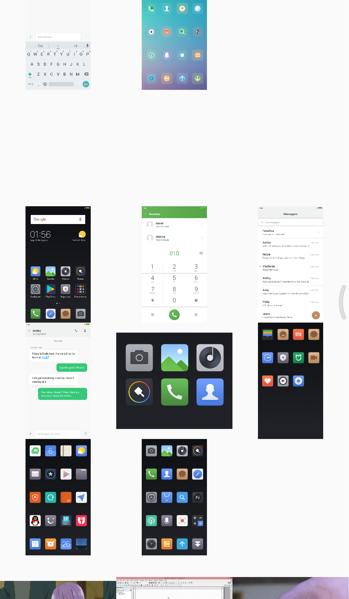
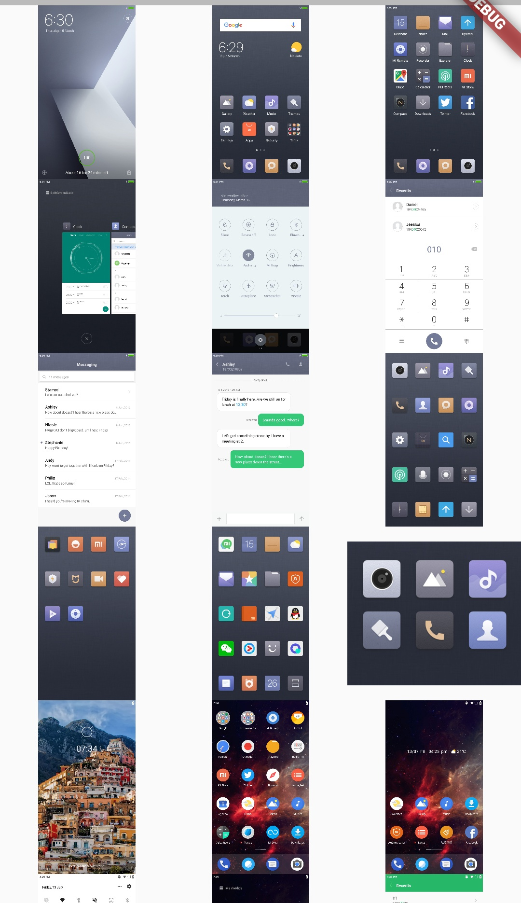

# flutter_file_manager

A set of utilities, that hepls to manage the files & directories in Android system.

version: 0.0.1

## Getting Started

For help getting started with Flutter, view our online [documentation](https://flutter.io/).

For help on editing package code, view the [documentation](https://flutter.io/developing-packages/).

## Screenshots

 
 
 

## Usage

To use this package, add these  
dependency in your `pubspec.yaml`  file.

```yaml
dependencies:
  flutter:
    sdk: flutter
  path: ^1.6.2
  path_provider: ^0.4.1
  flutter_file_manager: ^0.0.1
```
And, add read / write permissions in your
`android/app/src/main/AndroidManifest.xml`
````xml
<uses-permission android:name="android.permission.WRITE_EXTERNAL_STORAGE"/>
<uses-permission android:name="android.permission.READ_EXTERNAL_STORAGE"/>
````
Don't forget to give `Storage` permissions to your app, manually or by this plugin [simple_permissions](https://pub.dartlang.org/packages/simple_permissions)

```dart
var dir = await getExternalStorageDirectory();
List<String> imagesPaths = await FileManager.filesTreeList(dir.path,extensions: ["png", "jpg"]);
```
### Contributors
* [Mohamed Naga](https://github.com/eagle6789)

## Donate
* [PayPal](paypal.me/eagle6789)

### Contact me
me.developer.a@gmail.com